# 🔄 CI/CD Glue Health Check Solution

**Complete AWS Glue ETL Job Validation System for CI/CD Pipelines**

This solution provides automated health checks for AWS Glue ETL jobs during CI/CD workflows, ensuring code quality and preventing production issues through isolated testing with stub data.

## 📁 Project Structure

```
ci-cd-glue-health-check-solution/
├── 📁 docs/                                    # Documentation
│   └── CI_CD_Glue_Health_Check_Implementation.md
├── 📁 scripts/                                 # Execution Scripts (47.6KB)
│   ├── 🔧 glue_health_check.sh                 # Core Terraform workflow
│   ├── 🚀 glue_health_check_with_lambda.sh     # Lambda orchestration workflow  
│   ├── ⚙️ implement_health_check_system.sh     # System setup & deployment
│   ├── ▶️ run_glue_health_check.sh             # Job execution runner
│   └── 🧪 test_health_check_system.sh          # Testing & validation
├── 📁 src/                                     # Source Code
│   ├── 📁 jobs/health_check/                   # Glue Jobs (2.1KB)
│   │   └── data_processing_health_check.py     # Health check enabled Glue job
│   └── 📁 lambda/                              # Lambda Functions (26.7KB)
│       ├── 📁 cleanup/
│       │   └── lambda_function.py              # Resource cleanup orchestrator
│       ├── 📁 health_check_trigger/
│       │   └── lambda_function.py              # CI/CD webhook trigger
│       ├── 📁 job_monitor/
│       │   └── lambda_function.py              # Job status monitor
│       └── requirements.txt                    # Lambda dependencies
├── 📁 terraform/                               # Infrastructure (34.2KB)
│   └── 📁 modules/glue_health_check/
│       ├── lambda.tf                           # Lambda infrastructure
│       ├── main.tf                             # Core Glue resources
│       ├── outputs.tf                          # Output values
│       └── variables.tf                        # Configuration variables
├── .gitignore                                  # Git ignore patterns
└── README.md                                   # This documentation

Total: 15 files | 140.3KB | Production-ready solution
```

## 🏗️ Complete Solution Architecture

```mermaid
graph TB
    subgraph "Development Environment"
        DEV[Developer] --> GIT[Git Repository]
        GIT --> PR[Pull Request]
    end
    
    subgraph "CI/CD Pipeline"
        PR --> DRONE[Drone CI]
        PR --> GHA[GitHub Actions] 
        PR --> JENKINS[Jenkins]
        DRONE --> WEBHOOK[Webhook Trigger]
        GHA --> WEBHOOK
        JENKINS --> WEBHOOK
    end
    
    subgraph "AWS Lambda Orchestration"
        WEBHOOK --> TRIGGER[🔥 Trigger Lambda]
        TRIGGER --> PAYLOAD[Generate Job Payload]
        PAYLOAD --> CREATE[Create Glue Job]
    end
    
    subgraph "AWS Glue Execution"
        CREATE --> GLUE[⚡ Glue Health Check Job]
        GLUE --> STUB[📊 Stub Data Processing]
        STUB --> VALIDATE[✅ Validation Logic]
    end
    
    subgraph "Monitoring & Results"
        VALIDATE --> EVENT[📡 EventBridge Event]
        EVENT --> MONITOR[👀 Monitor Lambda]
        MONITOR --> STATUS{Job Status}
        STATUS -->|Success| SUCCESS[✅ Build PASSES]
        STATUS -->|Failure| FAILURE[❌ Build FAILS] 
        STATUS -->|Running| POLL[⏳ Continue Polling]
        POLL --> MONITOR
    end
    
    subgraph "Cleanup & Notifications"
        SUCCESS --> CLEANUP[🧹 Cleanup Lambda]
        FAILURE --> CLEANUP
        CLEANUP --> DELETE[🗑️ Delete Resources]
        DELETE --> NOTIFY[📧 Send Notifications]
        NOTIFY --> CICD[CI/CD Result]
    end
    
    subgraph "AWS Services Used"
        S3[📁 S3 Buckets]
        CW[📊 CloudWatch Logs]
        SNS[📧 SNS Notifications]
        IAM[🔐 IAM Roles]
        EB[⚡ EventBridge]
    end
    
    GLUE -.-> S3
    MONITOR -.-> CW
    NOTIFY -.-> SNS
    TRIGGER -.-> IAM
    EVENT -.-> EB
    
    style DEV fill:#e1f5fe
    style WEBHOOK fill:#f3e5f5
    style GLUE fill:#fff3e0
    style SUCCESS fill:#e8f5e8
    style FAILURE fill:#ffebee
    style CLEANUP fill:#f1f8e9
```



## 🔄 Process Flow Diagrams

### 1. Overall System Architecture

```mermaid
graph TB
    subgraph "CI/CD System"
        A[Developer Push] --> B[Pull Request Created]
        B --> C[CI/CD Pipeline Triggered]
    end
    
    subgraph "Health Check Orchestration"
        C --> D[Lambda Trigger Function]
        D --> E[Create Glue Health Check Job]
        E --> F[Execute with Stub Data]
        F --> G[Monitor Job Status]
        G --> H{Job Result}
    end
    
    subgraph "Result Processing"
        H -->|Success| I[✅ CI/CD Build PASSES]
        H -->|Failure| J[❌ CI/CD Build FAILS]
        I --> K[Cleanup Resources]
        J --> K
        K --> L[Send Notifications]
    end
    
    subgraph "AWS Services"
        E --> M[AWS Glue]
        F --> N[S3 Stub Data]
        G --> O[CloudWatch Logs]
        L --> P[SNS/Webhooks]
    end
```



### 2. Lambda Orchestration Workflow


### 3. Terraform Deployment Flow


### 4. CI/CD Integration Patterns

```mermaid
graph LR
    subgraph "Drone CI"
        D1[.drone.yml] --> D2[Health Check Step]
        D2 --> D3[Lambda Trigger]
    end
    
    subgraph "GitHub Actions"  
        G1[.github/workflows/] --> G2[Health Check Job]
        G2 --> G3[Lambda Trigger]
    end
    
    subgraph "Jenkins"
        J1[Jenkinsfile] --> J2[Health Check Stage]
        J2 --> J3[Lambda Trigger]
    end
    
    D3 --> HC[Health Check System]
    G3 --> HC
    J3 --> HC
    
    HC --> R{Result}
    R -->|Pass| P[✅ Build Success]
    R -->|Fail| F[❌ Build Failure]
```



## 🚀 Execution Methods

### Method 1: Lambda Orchestration (Recommended for CI/CD)

**🎯 Best for**: Production CI/CD pipelines, automated workflows, webhook integration

```bash
# Quick start with Lambda orchestration
./scripts/glue_health_check_with_lambda.sh

# With custom configuration
export LAMBDA_TRIGGER_FUNCTION="my-trigger-function"
export SCRIPT_LOCATION="s3://my-bucket/scripts/my-job.py"
./scripts/glue_health_check_with_lambda.sh
```

**Process Flow**:
1. **🔄 Initialization**: Auto-discover or use configured Lambda functions
2. **📤 Trigger**: Send PR details to Lambda trigger function
3. **⚡ Execution**: Lambda creates and starts Glue health check job
4. **👀 Monitor**: EventBridge + Lambda monitor job status in real-time
5. **📊 Results**: Automatic success/failure determination
6. **🧹 Cleanup**: Lambda cleanup removes all temporary resources

### Method 2: Direct Terraform Orchestration

**🎯 Best for**: Manual testing, debugging, development environments

```bash
# Traditional Terraform workflow
./scripts/glue_health_check.sh

# With debugging enabled
./scripts/glue_health_check.sh --debug

# Manual step-by-step execution
./scripts/run_glue_health_check.sh --job-suffix "manual-test"
```

**Process Flow**:
1. **🏗️ Deploy**: Create Terraform resources dynamically
2. **▶️ Execute**: Run health check job with monitoring
3. **⏳ Wait**: Poll job status until completion
4. **📋 Report**: Generate detailed execution report
5. **🗑️ Destroy**: Clean up Terraform resources

### Method 3: System Implementation & Testing

**🎯 Best for**: Initial setup, validation, troubleshooting

```bash
# Complete system setup
./scripts/implement_health_check_system.sh

# Comprehensive testing
./scripts/test_health_check_system.sh

# Validation of deployment
./scripts/test_health_check_system.sh --validate-only
```

## 📋 Configuration Files & Variables

### Environment Variables

| Variable | Description | Default | Required |
|----------|-------------|---------|----------|
| `USE_LAMBDA` | Use Lambda orchestration | `true` | No |
| `LAMBDA_TRIGGER_FUNCTION` | Lambda trigger function name | Auto-detect | No |
| `LAMBDA_MONITOR_FUNCTION` | Lambda monitor function name | Auto-detect | No |
| `LAMBDA_CLEANUP_FUNCTION` | Lambda cleanup function name | Auto-detect | No |
| `SCRIPT_LOCATION` | S3 location of Glue script | Various | Yes |
| `AWS_REGION` | AWS region | `us-east-1` | No |
| `HEALTH_CHECK_TIMEOUT` | Job timeout in minutes | `30` | No |
| `DRONE_BRANCH` | CI/CD branch name | `main` | No |
| `DRONE_PULL_REQUEST` | CI/CD PR number | Auto-generate | No |

### Terraform Variables

| Variable | Type | Description | Default |
|----------|------|-------------|---------|
| `deploy_lambda_functions` | bool | Deploy Lambda functions | `true` |
| `create_api_gateway` | bool | Create API Gateway | `false` |
| `enable_event_monitoring` | bool | Enable EventBridge monitoring | `true` |
| `job_suffix` | string | Unique job identifier | `""`|
| `script_location` | string | S3 script location | `""` |
| `max_capacity` | number | Glue job DPU capacity | `2` |
| `timeout_minutes` | number | Job timeout | `30` |
| `glue_version` | string | Glue version | `"4.0"` |

### Lambda Function Environment Variables

**Trigger Function**:
- `GLUE_ROLE_ARN`: IAM role for Glue jobs
- `SCRIPTS_BUCKET`: S3 bucket for scripts  
- `TEMP_BUCKET`: S3 bucket for temporary files
- `SNS_TOPIC_ARN`: SNS topic for notifications

**Monitor Function**:
- `SNS_TOPIC_ARN`: SNS topic for notifications
- `CLEANUP_FUNCTION_NAME`: Name of cleanup Lambda
- `WEBHOOK_URL`: CI/CD webhook for status updates

**Cleanup Function**:
- `SCRIPTS_BUCKET`: S3 bucket for scripts
- `TEMP_BUCKET`: S3 bucket for temporary files
- `METADATA_BUCKET`: S3 bucket for metadata

## 🔧 CI/CD Integration Examples

### Drone CI Configuration

```yaml
# .drone.yml
kind: pipeline
type: docker
name: glue-health-check

steps:
  - name: health-check
    image: alpine/aws-cli:latest
    environment:
      AWS_ACCESS_KEY_ID:
        from_secret: aws_access_key_id
      AWS_SECRET_ACCESS_KEY:
        from_secret: aws_secret_access_key
      AWS_DEFAULT_REGION: us-east-1
      LAMBDA_TRIGGER_FUNCTION: glue-health-check-trigger-prod
      SCRIPT_LOCATION: s3://my-glue-scripts/etl-job.py
    commands:
      - apk add --no-cache bash jq
      - chmod +x scripts/glue_health_check_with_lambda.sh
      - ./scripts/glue_health_check_with_lambda.sh

trigger:
  event:
    - pull_request
  branch:
    - main
    - develop
```

### GitHub Actions Configuration

```yaml
# .github/workflows/glue-health-check.yml
name: Glue ETL Health Check
on:
  pull_request:
    branches: [main, develop]
    paths: ['src/jobs/**', 'terraform/**']

jobs:
  health-check:
    runs-on: ubuntu-latest
    steps:
      - name: Checkout code
        uses: actions/checkout@v4
        
      - name: Configure AWS credentials
        uses: aws-actions/configure-aws-credentials@v4
        with:
          aws-access-key-id: ${{ secrets.AWS_ACCESS_KEY_ID }}
          aws-secret-access-key: ${{ secrets.AWS_SECRET_ACCESS_KEY }}
          aws-region: us-east-1
          
      - name: Run Glue Health Check
        env:
          LAMBDA_TRIGGER_FUNCTION: glue-health-check-trigger-prod
          SCRIPT_LOCATION: s3://my-glue-scripts/etl-job.py
          DRONE_PULL_REQUEST: ${{ github.event.number }}
          DRONE_BRANCH: ${{ github.head_ref }}
        run: |
          chmod +x scripts/glue_health_check_with_lambda.sh
          ./scripts/glue_health_check_with_lambda.sh
```

### Jenkins Configuration

```groovy
// Jenkinsfile
pipeline {
    agent any
    
    environment {
        AWS_DEFAULT_REGION = 'us-east-1'
        LAMBDA_TRIGGER_FUNCTION = 'glue-health-check-trigger-prod'
        SCRIPT_LOCATION = 's3://my-glue-scripts/etl-job.py'
    }
    
    stages {
        stage('Checkout') {
            steps {
                checkout scm
            }
        }
        
        stage('Glue Health Check') {
            when {
                changeRequest()
            }
            steps {
                withCredentials([[$class: 'AmazonWebServicesCredentialsBinding', 
                                credentialsId: 'aws-credentials']]) {
                    script {
                        env.DRONE_PULL_REQUEST = env.CHANGE_ID
                        env.DRONE_BRANCH = env.CHANGE_BRANCH
                    }
                    sh '''
                        chmod +x scripts/glue_health_check_with_lambda.sh
                        ./scripts/glue_health_check_with_lambda.sh
                    '''
                }
            }
        }
    }
    
    post {
        always {
            echo "Health check completed"
        }
        success {
            echo "✅ Glue ETL validation passed"
        }
        failure {
            echo "❌ Glue ETL validation failed"
        }
    }
}
```

## 📊 Monitoring & Observability

### CloudWatch Log Groups
- `/aws/lambda/glue-health-check-trigger-*` - Trigger function logs
- `/aws/lambda/glue-health-check-monitor-*` - Monitor function logs  
- `/aws/lambda/glue-health-check-cleanup-*` - Cleanup function logs
- `/aws-glue/health-check/*` - Glue job execution logs

### CloudWatch Metrics
- **Lambda Metrics**: Invocation count, duration, errors, throttles
- **Glue Metrics**: Job execution time, DPU usage, success/failure rates
- **Custom Metrics**: Health check pass/fail rates, average execution time

### SNS Notifications
Configure SNS topics to receive:
- 🚀 Health check started notifications
- ✅ Job completion (success)
- ❌ Job failure with error details
- 🧹 Cleanup completion
- ⚠️ Error alerts and timeouts

## 🛠️ Troubleshooting Guide

### Common Issues & Solutions

#### 1. Lambda Function Not Found
```bash
# Check if functions are deployed
aws lambda list-functions --query "Functions[?contains(FunctionName, 'health-check')]"

# Verify environment variables
echo "Trigger: $LAMBDA_TRIGGER_FUNCTION"
echo "Monitor: $LAMBDA_MONITOR_FUNCTION"
echo "Cleanup: $LAMBDA_CLEANUP_FUNCTION"
```

#### 2. Permission Errors
```bash
# Check Lambda execution role
aws iam get-role-policy \
  --role-name lambda-health-check-role-123 \
  --policy-name lambda-health-check-policy-123

# Verify Glue service role
aws iam get-role --role-name GlueHealthCheckRole
```

#### 3. Glue Job Creation Fails
```bash
# Check S3 script location
aws s3 ls s3://your-bucket/scripts/

# Verify script syntax
python3 -m py_compile your-script.py

# Test Glue job manually
aws glue start-job-run --job-name test-job --arguments '{"--health-check-mode":"true"}'
```

#### 4. Timeout Issues
```bash
# Increase timeout in Terraform
terraform apply -var="timeout_minutes=45"

# Check job progress
aws glue get-job-run --job-name health-check-job --run-id run-id
```

### Debug Mode
```bash
# Enable comprehensive debugging
export DEBUG=true
export AWS_CLI_FILE_ENCODING=UTF-8
./scripts/glue_health_check_with_lambda.sh --debug

# Check CloudWatch logs
aws logs tail /aws/lambda/glue-health-check-trigger-123 --follow
```

## 💰 Cost Analysis

### Cost Breakdown (per health check)

| Component | Cost | Duration | Total |
|-----------|------|----------|-------|
| **Lambda Functions** | | | |
| - Trigger | $0.0000002 × 100ms | < 1s | $0.001 |
| - Monitor | $0.0000002 × 5 calls | 30s | $0.002 |
| - Cleanup | $0.0000002 × 300ms | < 1s | $0.001 |
| **AWS Glue** | $0.44/DPU-hour × 2 DPU | 5 min | $0.044 |
| **CloudWatch** | $0.50/million events | Logs | $0.001 |
| **S3** | $0.023/GB | Minimal | < $0.001 |
| **TOTAL** | | | **~$0.048** |

### Monthly Estimates

| PR Volume | Monthly Cost | Annual Cost |
|-----------|--------------|-------------|
| 50 PRs/month | $2.40 | $28.80 |
| 200 PRs/month | $9.60 | $115.20 |
| 500 PRs/month | $24.00 | $288.00 |

### Cost Optimization Tips
1. **Use minimal Glue capacity** (2 DPU minimum)
2. **Set appropriate timeouts** (30 minutes default)
3. **Enable automatic cleanup** (prevent resource waste)
4. **Use scheduled cleanup** for orphaned resources
5. **Monitor with CloudWatch** to track usage patterns

## 🎯 Best Practices

### Development Workflow
1. **Local Testing**: Use stub data for development
2. **PR Validation**: Automatic health checks on pull requests
3. **Staging Deployment**: Full integration testing
4. **Production Release**: Confidence in deployment

### Security Considerations
- **IAM Least Privilege**: Minimal required permissions
- **VPC Integration**: Optional private subnet deployment
- **Encryption**: S3 and CloudWatch logs encryption
- **Secrets Management**: Use AWS Secrets Manager for sensitive data

### Performance Optimization
- **Glue Version**: Use latest Glue 4.0 for better performance
- **Resource Sizing**: Match DPU capacity to workload
- **Caching**: Enable Glue job bookmark for incremental processing
- **Monitoring**: Track execution patterns for optimization

## 🔄 Version History

| Version | Date | Changes |
|---------|------|---------|
| 1.0.0 | 2024-06-18 | Initial release with Lambda orchestration |
| | | Complete CI/CD integration |
| | | Terraform infrastructure automation |
| | | Comprehensive documentation |

---

**🚀 Ready to transform your Glue CI/CD pipeline?**

Start with: `./scripts/implement_health_check_system.sh`

**📧 Questions?** Check the troubleshooting guide or review CloudWatch logs for detailed execution information.

---

*This solution provides enterprise-grade CI/CD validation for AWS Glue ETL jobs with minimal cost and maximum reliability.* ⚡ 