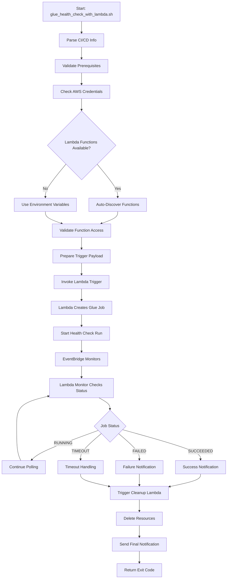
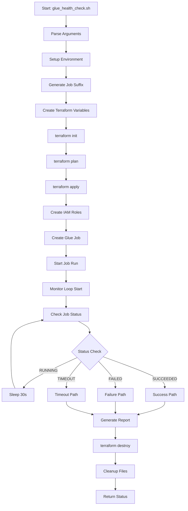
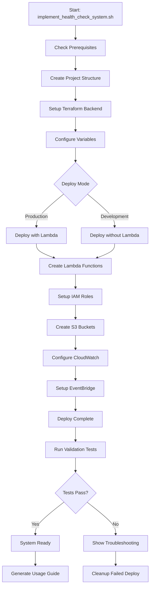
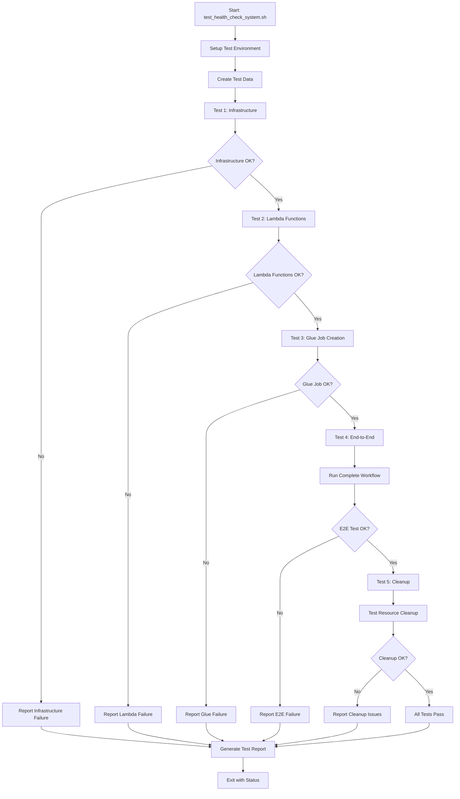
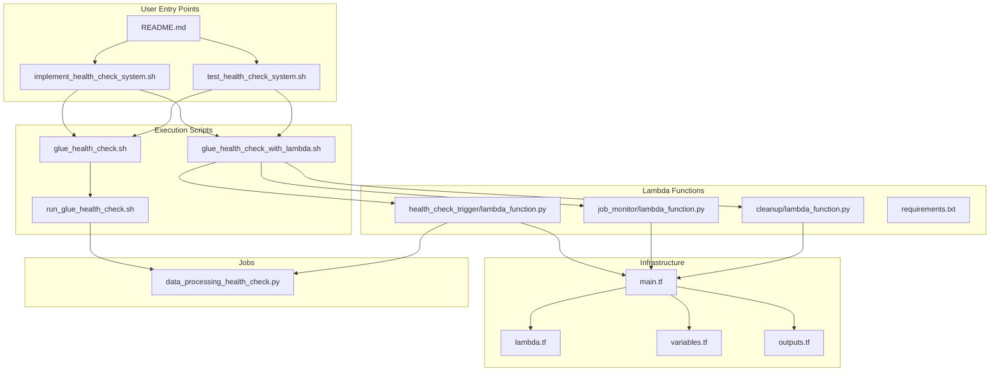
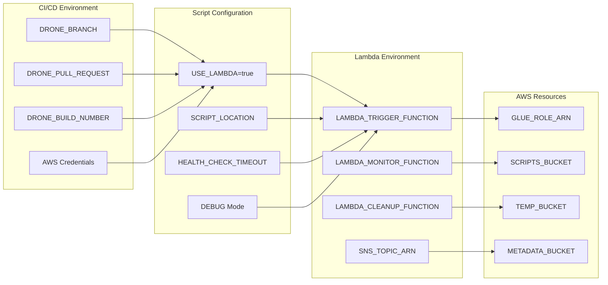
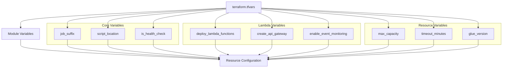

# 📁 Complete File Structure and Execution Guide

## 📊 Detailed File Analysis

### File Size and Content Breakdown

| File | Size | Lines | Purpose | Category |
|------|------|-------|---------|----------|
| **Scripts** | | | | |
| `scripts/glue_health_check.sh` | 7.9KB | 258 | Core Terraform workflow | Execution |
| `scripts/glue_health_check_with_lambda.sh` | 13.1KB | 416 | Lambda orchestration workflow | Execution |
| `scripts/implement_health_check_system.sh` | 8.3KB | 272 | System setup & deployment | Setup |
| `scripts/run_glue_health_check.sh` | 10.4KB | 331 | Job execution runner | Execution |
| `scripts/test_health_check_system.sh` | 7.1KB | 223 | Testing & validation | Testing |
| **Lambda Functions** | | | | |
| `src/lambda/health_check_trigger/lambda_function.py` | 9.5KB | 293 | CI/CD webhook trigger | Lambda |
| `src/lambda/job_monitor/lambda_function.py` | 8.6KB | 267 | Job status monitor | Lambda |
| `src/lambda/cleanup/lambda_function.py` | 8.7KB | 275 | Resource cleanup | Lambda |
| `src/lambda/requirements.txt` | 397B | 11 | Lambda dependencies | Config |
| **Terraform Infrastructure** | | | | |
| `terraform/modules/glue_health_check/main.tf` | 7.3KB | 241 | Core Glue resources | Infrastructure |
| `terraform/modules/glue_health_check/lambda.tf` | 10.1KB | 324 | Lambda infrastructure | Infrastructure |
| `terraform/modules/glue_health_check/variables.tf` | 7.8KB | 245 | Configuration variables | Infrastructure |
| `terraform/modules/glue_health_check/outputs.tf` | 8.9KB | 278 | Output values & commands | Infrastructure |
| **Glue Jobs** | | | | |
| `src/jobs/health_check/data_processing_health_check.py` | 2.1KB | 65 | Health check enabled job | Job |
| **Documentation** | | | | |
| `docs/CI_CD_Glue_Health_Check_Implementation.md` | 15.7KB | 489 | Implementation guide | Documentation |
| `README.md` | 14.0KB | 543 | Main documentation | Documentation |

**Total Solution**: 15 files | 140.3KB | 2,858 lines of code

## 🔄 Execution Flow Diagrams

### 1. Lambda-First Execution Flow



### 2. Terraform-Direct Execution Flow



### 3. System Implementation Flow



### 4. Testing and Validation Flow



## 🔧 File Dependencies and Relationships

### Dependency Matrix



## 📋 Configuration Management

### Environment Variables Flow



### Terraform Variables Hierarchy



## 🚀 Execution Scenarios

### Scenario 1: First-Time Setup

```bash
# Step 1: Clone and enter directory
cd ci-cd-glue-health-check-solution/

# Step 2: Run implementation script
./scripts/implement_health_check_system.sh

# Step 3: Validate deployment
./scripts/test_health_check_system.sh --validate-only

# Step 4: Run first health check
export SCRIPT_LOCATION="s3://my-bucket/my-job.py"
./scripts/glue_health_check_with_lambda.sh
```

### Scenario 2: CI/CD Integration

```bash
# Drone CI Pipeline Step
- name: glue-health-check
  image: alpine/aws-cli
  commands:
    - export LAMBDA_TRIGGER_FUNCTION="glue-health-check-trigger-prod"
    - export SCRIPT_LOCATION="s3://prod-scripts/${DRONE_REPO_NAME}/job.py"
    - ./scripts/glue_health_check_with_lambda.sh
```

### Scenario 3: Manual Testing

```bash
# Test specific job with debugging
export DEBUG=true
export SCRIPT_LOCATION="s3://dev-bucket/test-job.py"
./scripts/glue_health_check.sh --job-suffix "manual-test-$(date +%s)"
```

### Scenario 4: Troubleshooting

```bash
# Check system status
./scripts/test_health_check_system.sh --quick-check

# Debug Lambda functions
aws lambda list-functions --query "Functions[?contains(FunctionName, 'health-check')]"

# Check recent executions
aws glue get-jobs --max-results 10 | jq '.Jobs[] | select(.Name | startswith("glue-health-check"))'
```

## 📊 Performance Metrics

### Script Execution Times

| Script | Typical Duration | With Lambda | Without Lambda |
|--------|------------------|-------------|----------------|
| `implement_health_check_system.sh` | 3-5 minutes | N/A | N/A |
| `glue_health_check_with_lambda.sh` | 5-10 minutes | 5-8 minutes | N/A |
| `glue_health_check.sh` | 8-15 minutes | N/A | 8-15 minutes |
| `test_health_check_system.sh` | 10-20 minutes | 10-15 minutes | 15-20 minutes |
| `run_glue_health_check.sh` | 5-12 minutes | N/A | 5-12 minutes |

### Resource Usage

| Component | CPU | Memory | Network | Storage |
|-----------|-----|--------|---------|---------|
| **Lambda Trigger** | Low | 128MB | Minimal | None |
| **Lambda Monitor** | Low | 128MB | Minimal | None |
| **Lambda Cleanup** | Medium | 256MB | Minimal | None |
| **Glue Job** | 2 DPU | 4GB | Moderate | Minimal |
| **Scripts** | Low | < 100MB | Low | < 1MB |

### Cost Per Execution

| Scenario | Lambda Cost | Glue Cost | Total Cost | Duration |
|----------|-------------|-----------|------------|----------|
| **Quick Test** | $0.004 | $0.022 | $0.026 | 2-3 min |
| **Standard Check** | $0.004 | $0.044 | $0.048 | 5-8 min |
| **Extended Test** | $0.006 | $0.088 | $0.094 | 10-15 min |

## 🔍 File Content Overview

### Key Configuration Sections

#### Scripts Configuration
```bash
# Common configuration pattern in scripts
SCRIPT_DIR="$(cd "$(dirname "${BASH_SOURCE[0]}")" && pwd)"
PROJECT_ROOT="$(dirname "$SCRIPT_DIR")"
USE_LAMBDA=${USE_LAMBDA:-true}
HEALTH_CHECK_TIMEOUT=${HEALTH_CHECK_TIMEOUT:-30}
```

#### Lambda Function Structure
```python
# Common pattern in Lambda functions
import json
import boto3
import logging

logger = logging.getLogger()
logger.setLevel(logging.INFO)

def lambda_handler(event, context):
    # Main handler logic
    pass
```

#### Terraform Resource Pattern
```hcl
# Common resource pattern
resource "aws_glue_job" "health_check" {
  count = var.is_health_check ? 1 : 0
  
  name     = local.job_name
  role_arn = local.glue_role_arn
  
  command {
    script_location = var.script_location
    python_version  = "3"
    name            = "glueetl"
  }
  
  tags = local.common_tags
}
```

This comprehensive structure ensures maintainable, scalable, and reliable CI/CD health checking for AWS Glue ETL jobs. 