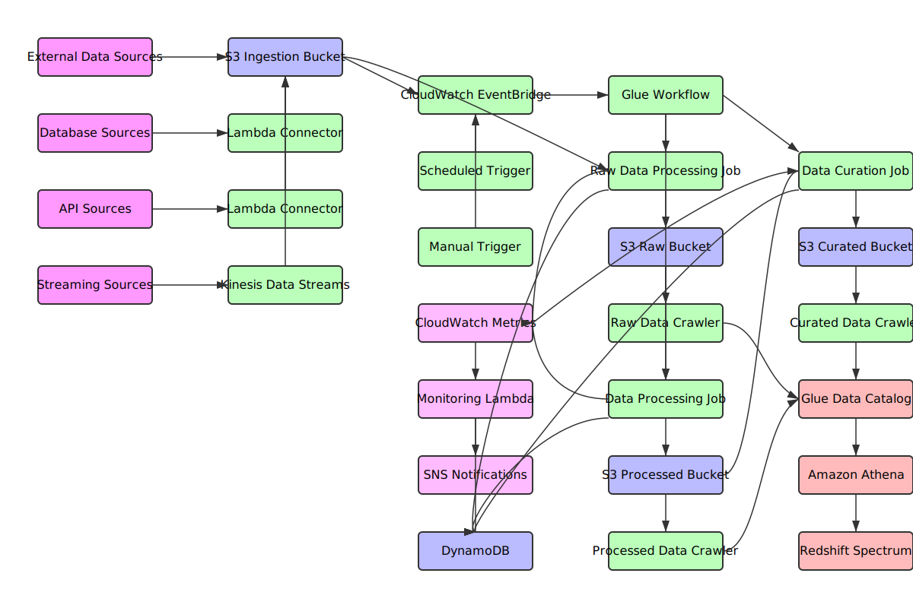

# AWS Glue ETL Pipeline: Data Flow and Process Documentation

## Data Flow Diagram

The following diagram illustrates the end-to-end data flow through the AWS Glue ETL pipeline, from ingestion to consumption:

The diagram shows the complete flow from data sources through processing stages to final consumption:

1. **Data Sources** → Various external sources feed data into the pipeline
2. **Ingestion Layer** → Data is collected in S3 ingestion buckets
3. **Trigger Mechanisms** → EventBridge coordinates job execution
4. **Processing Layers** → Raw → Processed → Curated data transformations
5. **Data Cataloging** → Glue Crawlers maintain metadata in the Glue Catalog
6. **Data Access** → Athena and Redshift provide query interfaces
7. **Monitoring** → CloudWatch, Lambda, and SNS provide observability

> Note: A Mermaid-format version of this diagram is also available in `diagrams/data_flow_diagram.md`

## Execution Process

### 1. Execution Flow

The AWS Glue ETL pipeline follows this execution flow:

1. **Data Ingestion Trigger**:
   - Scheduled triggers via CloudWatch Events
   - S3 event notifications when new data arrives
   - Manual triggers through AWS Console or API
   - CI/CD pipeline automated deployments

2. **Job Orchestration**:
   - AWS Glue Workflows coordinate the execution sequence
   - Dependencies between jobs are managed through workflow graphs
   - Error handling and retry mechanisms are implemented

3. **Job Execution**:
   - Glue jobs run on serverless Spark clusters (Glue version 4.0, Python 3.10)
   - Dynamic resource allocation based on data volume
   - Execution within VPC private subnets for security
   - Monitoring through CloudWatch and custom Lambda functions

4. **Data Cataloging**:
   - Glue Data Crawlers scan raw, processed, and curated data layers
   - Metadata is stored in the AWS Glue Data Catalog
   - Schema evolution is tracked and managed

### 2. Infrastructure Deployment

The deployment process follows these steps:

1. **Environment Selection**:
   - Environment-specific configurations via tfvars files (dev, staging, prod)
   - Region selection with multi-region support for disaster recovery

2. **Resource Provisioning**:
   - Terraform modules create all required AWS resources
   - S3 buckets with appropriate lifecycle policies
   - IAM roles with least privilege access
   - VPC networking with security groups
   - Glue jobs, crawlers, and triggers

3. **Code Deployment**:
   - ETL scripts uploaded to S3 script buckets
   - Lambda functions packaged and deployed
   - Glue job parameters configured

## Data Input Integration Process

### 1. Source Data Connectors

The pipeline supports multiple data source integrations:

1. **Batch Data Sources**:
   - S3 buckets with various file formats (CSV, JSON, Parquet, Avro)
   - JDBC connections to relational databases
   - NoSQL databases via custom connectors
   - API integrations through Lambda functions

2. **Streaming Data Sources**:
   - Kinesis Data Streams integration
   - Kafka/MSK connector support
   - DynamoDB streams

### 2. Data Ingestion Methods

1. **Pull-based Ingestion**:
   - Scheduled Glue jobs extract data from source systems
   - Connection parameters stored in AWS Secrets Manager
   - Incremental extraction using watermarks and change tracking

2. **Push-based Ingestion**:
   - S3 event notifications trigger processing when new data arrives
   - API Gateway endpoints for direct data submission
   - Custom connectors for real-time data feeds

### 3. Data Validation & Quality Checks

1. **Schema Validation**:
   - Data structure validation against expected schemas
   - Type checking and format validation
   - Required field verification

2. **Quality Checks**:
   - Data completeness checks
   - Range and constraint validation
   - Duplicate detection
   - Referential integrity verification

3. **Error Handling**:
   - Invalid data routing to error buckets
   - Detailed error logging with context
   - Notification system for data quality issues

## Data Output & Onward Transmission

### 1. Data Storage Layers

1. **Raw Data Layer**:
   - Original data preserved in its native format
   - Immutable storage with versioning
   - Lifecycle policies for cost optimization
   - Crawlers catalog raw data for discovery

2. **Processed Data Layer**:
   - Cleaned, validated, and transformed data
   - Optimized formats (Parquet, ORC)
   - Partitioning for query performance
   - Crawlers maintain metadata in Glue Catalog

3. **Curated Data Layer**:
   - Business-ready datasets
   - Aggregated and enriched data
   - Query-optimized structures
   - Crawlers enable seamless querying

### 2. Data Access Methods

1. **Query Interfaces**:
   - Athena for SQL-based ad-hoc queries
   - Redshift Spectrum for data warehouse integration
   - EMR for large-scale analytics
   - QuickSight for visualization

2. **API Access**:
   - API Gateway endpoints for programmatic access
   - Lambda functions for data transformation and delivery
   - AppSync GraphQL interfaces for flexible queries

### 3. Data Transmission Patterns

1. **Batch Exports**:
   - Scheduled exports to downstream systems
   - Notification-based data sharing
   - Format conversion for target system compatibility

2. **Real-time Data Sharing**:
   - Kinesis Data Firehose for real-time delivery
   - Event-driven architecture with SNS/SQS
   - WebSocket APIs for live data feeds

3. **Cross-account/Cross-region Sharing**:
   - S3 cross-region replication for disaster recovery
   - AWS RAM (Resource Access Manager) for cross-account access
   - Lake Formation for fine-grained access control

### 4. Security & Governance

1. **Data Protection**:
   - Encryption at rest (S3 with KMS) and in transit (TLS)
   - VPC endpoints for private network traffic
   - IAM roles with least privilege access

2. **Data Governance**:
   - Metadata management through Glue Data Catalog
   - Data lineage tracking
   - Audit logging of all data access
   - Compliance with data retention policies

## Integration with Glue Data Crawlers

The recently integrated Glue Data Crawlers enhance the pipeline's capabilities:

1. **Automated Schema Discovery**:
   - Crawlers automatically detect and register schemas from all data layers
   - Support for schema evolution and versioning
   - Scheduled runs ensure catalog stays up-to-date

2. **Metadata Management**:
   - Table definitions automatically created in Glue Data Catalog
   - Partition detection for optimized queries
   - Column-level metadata including data types and statistics

3. **Integration Points**:
   - Raw data crawler runs after ingestion jobs complete
   - Processed data crawler runs after transformation jobs
   - Curated data crawler runs after aggregation jobs
   - All crawlers can be triggered on-demand or on schedule

4. **Configuration Options**:
   - Customizable path patterns for each data layer
   - Adjustable crawler schedules per environment
   - VPC connectivity for secure network access
   - IAM roles with least privilege permissions
