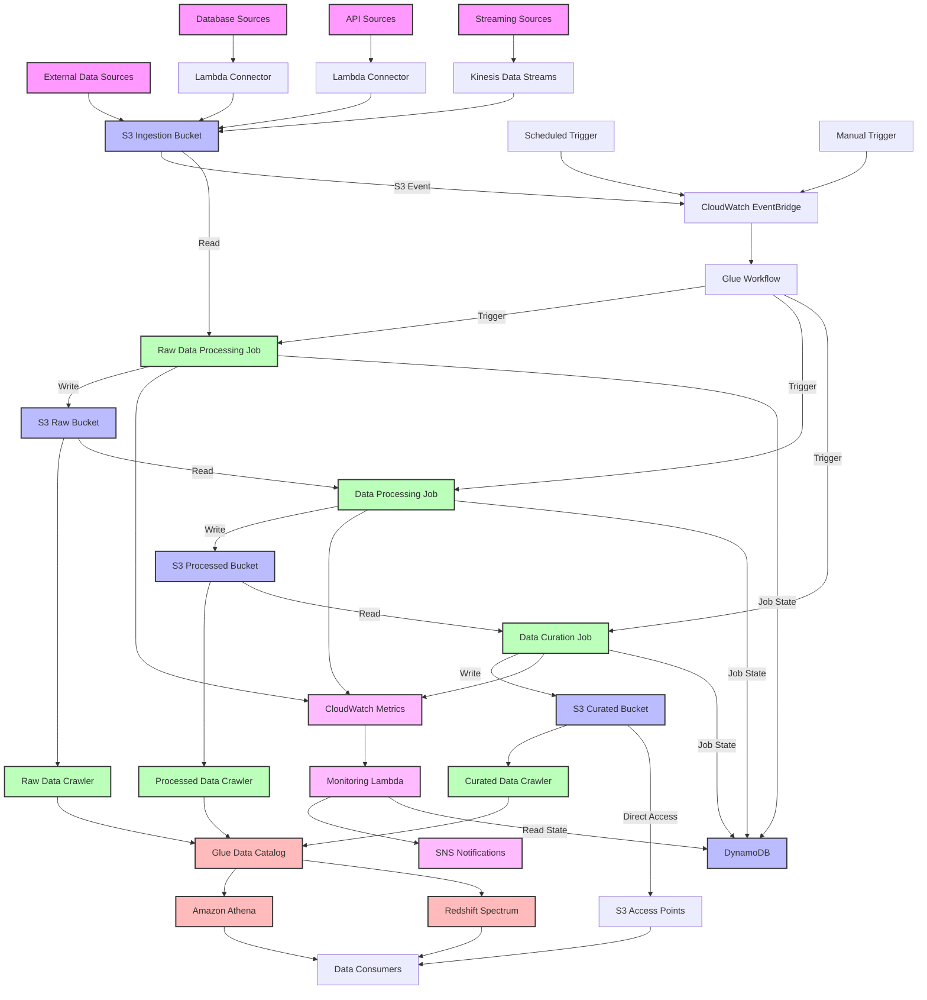

```mermaid
graph TD
    %% Data Sources
    DS1[External Data Sources] --> S3IN[S3 Ingestion Bucket]
    DS2[Database Sources] --> Lambda1[Lambda Connector]
    DS3[API Sources] --> Lambda2[Lambda Connector]
    DS4[Streaming Sources] --> Kinesis[Kinesis Data Streams]
    
    %% Ingestion Layer
    Lambda1 --> S3IN
    Lambda2 --> S3IN
    Kinesis --> S3IN
    
    %% Trigger Mechanisms
    S3IN --> |S3 Event| EventBridge[CloudWatch EventBridge]
    Schedule[Scheduled Trigger] --> EventBridge
    Manual[Manual Trigger] --> EventBridge
    
    %% Workflow Orchestration
    EventBridge --> GlueWorkflow[Glue Workflow]
    
    %% Data Processing
    GlueWorkflow --> |Trigger| RawJob[Raw Data Processing Job]
    S3IN --> |Read| RawJob
    RawJob --> |Write| S3Raw[S3 Raw Bucket]
    
    %% Raw Data Crawling
    S3Raw --> RawCrawler[Raw Data Crawler]
    RawCrawler --> GlueCatalog[Glue Data Catalog]
    
    %% Processing Layer
    GlueWorkflow --> |Trigger| ProcessJob[Data Processing Job]
    S3Raw --> |Read| ProcessJob
    ProcessJob --> |Write| S3Process[S3 Processed Bucket]
    
    %% Processed Data Crawling
    S3Process --> ProcessCrawler[Processed Data Crawler]
    ProcessCrawler --> GlueCatalog
    
    %% Curation Layer
    GlueWorkflow --> |Trigger| CurateJob[Data Curation Job]
    S3Process --> |Read| CurateJob
    CurateJob --> |Write| S3Curate[S3 Curated Bucket]
    
    %% Curated Data Crawling
    S3Curate --> CurateCrawler[Curated Data Crawler]
    CurateCrawler --> GlueCatalog
    
    %% Data Access
    GlueCatalog --> Athena[Amazon Athena]
    GlueCatalog --> Redshift[Redshift Spectrum]
    S3Curate --> |Direct Access| S3Access[S3 Access Points]
    
    %% Data Consumption
    Athena --> Consumers[Data Consumers]
    Redshift --> Consumers
    S3Access --> Consumers
    
    %% Monitoring
    RawJob --> CloudWatch[CloudWatch Metrics]
    ProcessJob --> CloudWatch
    CurateJob --> CloudWatch
    CloudWatch --> MonitoringLambda[Monitoring Lambda]
    MonitoringLambda --> SNS[SNS Notifications]
    
    %% State Tracking
    RawJob --> |Job State| DynamoDB[DynamoDB]
    ProcessJob --> |Job State| DynamoDB
    CurateJob --> |Job State| DynamoDB
    MonitoringLambda --> |Read State| DynamoDB
    
    %% Style
    classDef source fill:#f9f,stroke:#333,stroke-width:2px
    classDef storage fill:#bbf,stroke:#333,stroke-width:2px
    classDef process fill:#bfb,stroke:#333,stroke-width:2px
    classDef catalog fill:#fbb,stroke:#333,stroke-width:2px
    classDef monitoring fill:#fbf,stroke:#333,stroke-width:2px
    
    class DS1,DS2,DS3,DS4 source
    class S3IN,S3Raw,S3Process,S3Curate,DynamoDB storage
    class RawJob,ProcessJob,CurateJob,RawCrawler,ProcessCrawler,CurateCrawler process
    class GlueCatalog,Athena,Redshift catalog
    class CloudWatch,MonitoringLambda,SNS monitoring
```
