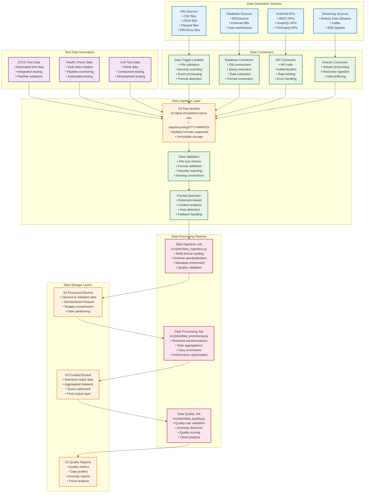

# Data Generation Flow Diagram

This diagram specifically focuses on the data generation and ingestion process in the AWS Glue ETL pipeline.



## Data Generation Process Details

### 1. External Data Sources

#### API Data Sources
- **REST APIs**: Real-time data from external services
- **GraphQL APIs**: Flexible data querying and retrieval
- **Third-party APIs**: Integration with external data providers

#### Database Sources
- **RDS/Aurora**: Relational database connections
- **External Databases**: Cross-platform database integration
- **Data Warehouses**: Enterprise data warehouse connections

#### File Sources
- **CSV Files**: Comma-separated values with headers
- **JSON Files**: Structured data in JSON format
- **Parquet Files**: Columnar storage format for analytics
- **ORC/Avro Files**: Optimized binary data formats

#### Streaming Sources
- **Kinesis Data Streams**: Real-time data streaming
- **Kafka**: Message streaming platform
- **SQS**: Simple Queue Service for message processing

### 2. Test Data Generation

#### CI/CD Test Data
```bash
# Automated test data generation
echo "id,customer_id,transaction_date,amount" > test-data/test.csv
echo "1,C001,2023-01-01,100.00" >> test-data/test.csv
echo "2,C002,2023-01-01,200.00" >> test-data/test.csv
```

#### Health Check Data
```python
# Stub data for pipeline health monitoring
def create_stub_data():
    test_data = [("test_1", "value_1", datetime.now())]
    schema = StructType([
        StructField("id", StringType(), True),
        StructField("value", StringType(), True),
        StructField("timestamp", TimestampType(), True)
    ])
    return spark.createDataFrame(test_data, schema)
```

#### Unit Test Data
```python
# Mock data for component testing
data = [
    {"id": "1", "customer_id": "C001", "amount": "100.00"},
    {"id": "2", "customer_id": "C002", "amount": "200.00"},
    {"id": "3", "customer_id": "C003", "amount": "300.00"},
]
```

### 3. Data Connectors

#### Data Trigger Lambda
- File validation and security scanning
- Event processing and format detection
- S3 event handling and routing

#### Database Connector
- Database connection management
- Query execution and data extraction
- Format conversion and optimization

#### API Connector
- API authentication and rate limiting
- Error handling and retry logic
- Data transformation and formatting

#### Kinesis Consumer
- Real-time stream processing
- Data buffering and batching
- Error handling and recovery

### 4. Data Processing Pipeline

#### Ingestion Job
- Multi-format file reading (CSV, JSON, Parquet, ORC, Avro)
- Schema standardization and column cleaning
- Data quality validation and metadata enrichment
- Date partitioning and Parquet output with Snappy compression

#### Processing Job
- Business rule applications and data transformations
- Data aggregations and calculations
- Data enrichment from external sources
- Spark optimizations and performance tuning

#### Quality Job
- Configurable quality rules validation
- Data profiling and anomaly detection
- Quality score calculation and trend analysis
- Threshold-based alerting and reporting

### 5. Data Storage Layers

#### Raw Data Layer
- Original data preservation in S3
- Immutable storage with versioning
- Multiple format support
- Lifecycle policies for cost optimization

#### Processed Data Layer
- Cleaned and validated data
- Standardized Parquet format
- Snappy compression for efficiency
- Date partitioning for query performance

#### Curated Data Layer
- Business-ready datasets
- Aggregated and enriched data
- Query-optimized structures
- Final output for consumption

#### Quality Reports Layer
- Quality metrics and data profiles
- Anomaly reports and trend analysis
- Monitoring and alerting data
- Historical quality tracking

This comprehensive data generation and processing flow ensures reliable, high-quality data pipeline from various sources through to business-ready outputs.
